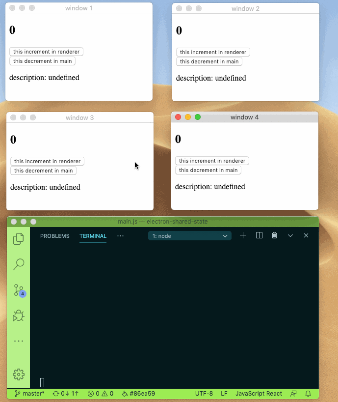

# electron-shared-state 

Sharing state between main and renderer process can be this easy.

- 🚀 Mutate your state while keep them in sync with other process
- 🎯 Write in typescript with full typing support
- ❤️ Elegant and easy to learn API
- 👻 Immutability and structural sharing out of the box with built-in immer



## Install

```sh
npm install electron-shared-state
```

or

```sh
yarn add electron-shared-state
```

## Usage

```ts
// shared
export const initialState = 0;

// renderer
import { createSharedStore } from 'electron-shared-state';
const sharedStore = createSharedStore(initialState);
sharedStore.subscribe(state => {
  console.log(state);
});

setTimeout(() => {
  sharedStore.setState(state => {
    state = state + 1;
  });
}, 2000);

// main
import { createSharedStore } from 'electron-shared-state';
const sharedStore = createSharedStore(initialState);
sharedStore.subscribe(state => {
  console.log(state);
});

// both main and renderer will print the state after two seconds.
```

check source code under [example directory](/example) for more info.

## API Reference

electron-shared-state only provides one simple function: `createSharedStore`. The signature is like below:

```ts
function createSharedStore<T>(
  state: T
): {
  setState: (recipe: (draft: T) => void, description?: string | undefined) => T;
  getState: () => T;
  subscribe: (
    listener: (state: T, description?: string | undefined) => void
  ) => () => void;
};
```

The input is the state your want to share across processes, generally it's an object.

It returns a Store object with a few methods on it.

**`setState(stateUpdater, description)`**

Accepts a stateUpdater function and a description string for debug purpose. The stateUpdater is like the second argument of immer's produce, so it inherits [immer's pitfalls](https://immerjs.github.io/immer/docs/pitfalls).

Returns the new state. It use immer underneath so the state remains immutable, to keep it in sync across processes, you should always use setState to update it.

**`getState()`**

Returns the current state.

**`subscribe(listener)`**

Adds a change listener. It will be called any time the state is changed, the listener receives the latest state and a description string as arguments.
